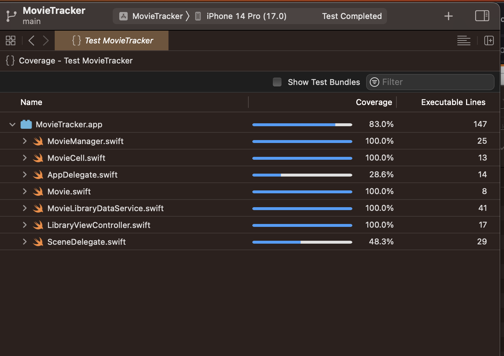

<!--
 * **********************************************************
 * Author: Balita Rakotonarivo								*
 * Date: September 2023										*
 * Context: Deliberate practice, as an iOS developper		*
 * Language: Swift 											*
 * **********************************************************
-->

# MovieTracker

A sample app to showcase **Test-Driven Development** (TDD) in Xcode, with UIKit.

This app serves to have a list of movies that the user has to watch, and allows her to check it off once done.

## Screenshot and Videos 

Here is the screenshot of the app, and a link to a short video demonstration.

 
MovieTracker App, <a target=”_blank” href="https://youtube.com/shorts/mSlzWnqIKWw?feature=share">watch demo on Youtube</a>

## Technical Details

This app is written in Swift and relies on Storyboards and UIKit. It implements a **Model-View-Controller** pattern.

It showcases simple unit tests, testing Models - Views - Controllers, using mocks, and dependancy injection. It also has *code coverage* enabled, so that testing analytics are available.

### Testing analytics

Here are the data from the final testing report, after enabling *Code Coverage*:

 
Code Coverage: 100% on self-written code, only AppDelegate and SceneDelegate classes were not tested.

 
Log: All tests passed, without any issue.

 
Tests details (duration, number, ...)

## Contact

<a href="mailto:jery.sarim@gmail.com?subject=SwiftUI-GeniusApp">Let's get in touch.</a> 
